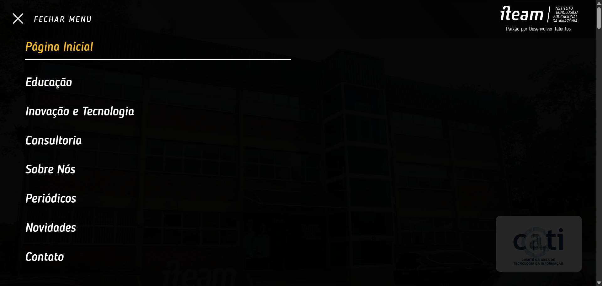
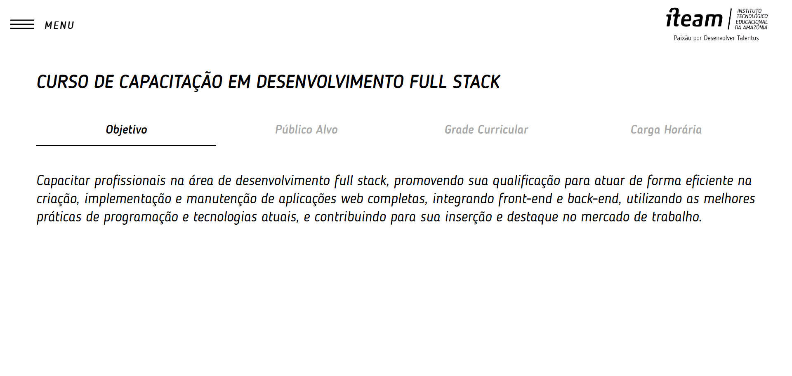
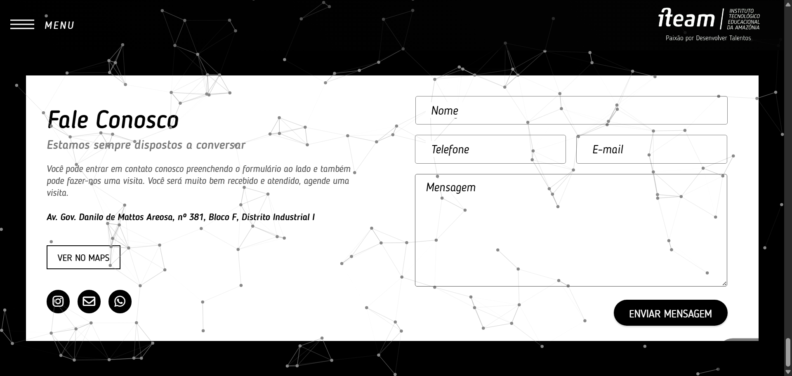
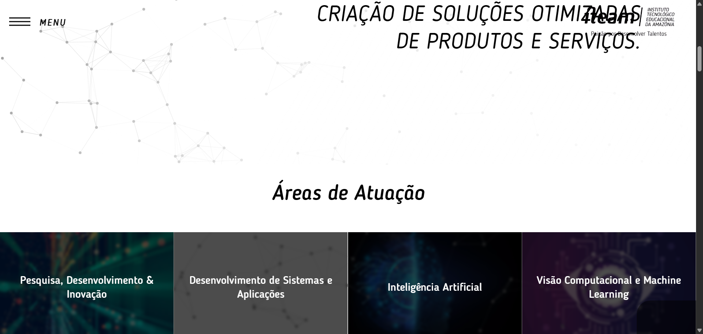
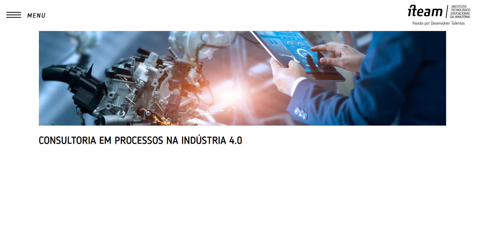
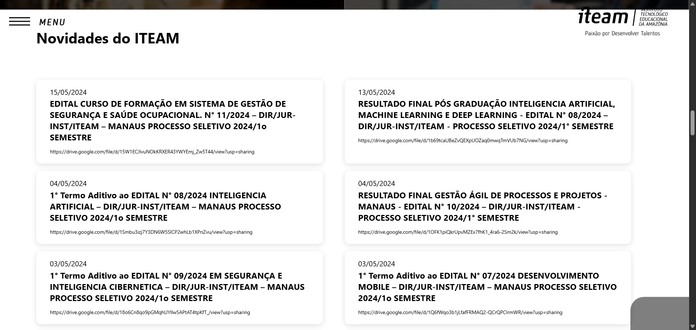
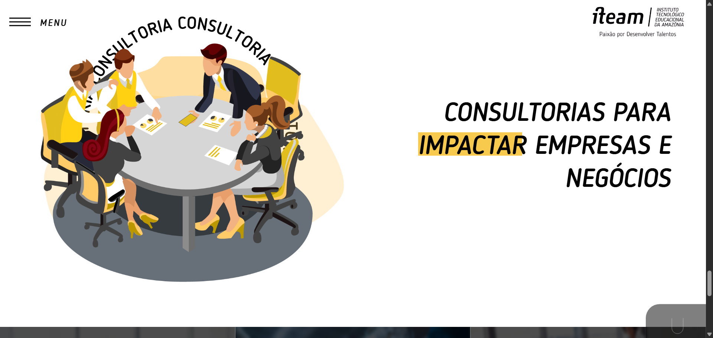

# 🔍 Auditoria de Arquitetura da Informação

## 1. Identificação da Análise
* **Site analisado:** ITEAM — Instituto Tecnológico Educacional da Amazônia
* **URL:** [https://www.iteam.org.br/](https://www.iteam.org.br/)
* **Tipo de site:** Institucional / Educacional
* **Objetivo da análise:** Realizar uma auditoria rápida da Arquitetura da Informação e da Interface do Usuário (UI) do site. A análise foca na organização, navegação, encontrabilidade de tarefas essenciais (buscar cursos e editais) e na identificação de atritos visuais que prejudicam a experiência do usuário.

---

## 2. Visão Geral: Arquitetura da Informação e Navegação

### Organização e Rotulagem
O site apresenta uma estrutura organizada por tópicos institucionais (Educação, Inovação e Tecnologia, Consultoria, Sobre Nós, Periódicos, Novidades, Contato). 
* **Ponto de atenção:** Essa organização reflete *o que a instituição é*, mas não está otimizada para *o que o usuário deseja fazer*. Rótulos cruciais para a conversão, como **"Cursos"**, **"Editais"**, **"Inscrições"** e **"Resultados"**, não aparecem de forma direta na navegação primária.

### Navegação Desktop vs. Mobile
* **Erro de Padrão:** Na versão para computadores (desktop), o site utiliza um menu "hambúrguer" que abre em tela cheia (comportamento típico de aplicativos mobile). Isso esconde as opções de navegação que poderiam estar visíveis horizontalmente na barra superior, forçando cliques extras e desorientando o usuário.

> **Evidência:**
> 

### Ausência de Sistema de Busca (Search)
* **Falha Crítica de Encontrabilidade:** O site não possui nenhum campo de pesquisa global (ícone de lupa ou barra de busca) no cabeçalho, no menu ou no rodapé. Em sites institucionais complexos, quando a arquitetura da informação falha em guiar o usuário, a barra de busca atua como um sistema de recuperação essencial. Sem ela, o usuário que não encontra um edital ou curso pela navegação comum é forçado a abandonar a página.

---

## 3. Análise de Tarefas do Usuário

### Tarefa A: Encontrar um Curso
* **Atrito na jornada:** A informação existe, mas o caminho é oculto. O usuário precisa adivinhar que "Cursos" está dentro de "Educação". Além disso, os links de entrada para os cursos se dão por meio de dois banners no rodapé da seção que são muito escuros e se camuflam com o fundo, passando despercebidos.

> **Evidência - Banners camuflados:**
> 

* **Ponto Positivo:** Ao superar as barreiras de navegação e chegar à página interna do curso, o conteúdo é excelente. A organização em abas (Objetivo, Público Alvo, Grade Curricular, Carga Horária) é limpa e eficiente.

> **Evidência - Informações do Curso:**
> 

### Tarefa B: Encontrar Editais, Processos Seletivos e Resultados
* **Atrito na jornada:** Não há uma área dedicada. O candidato precisa caçar essas informações na aba "Novidades", exigindo que ele interprete títulos genéricos de postagens para descobrir se é uma notícia comum, um edital ou uma retificação. Isso gera alta carga cognitiva.

### Tarefa C: Informações Institucionais e Legais
* **Contato (🟢 Bom):** A área "Fale Conosco" apresenta formulário e endereço físico de forma clara.

> **Evidência - Área de Contato:**
> 

* **Política de Privacidade (🔴 Ruim):** Não há um link de acesso rápido (geralmente posicionado no rodapé), dificultando o acesso a informações sobre tratamento de dados e LGPD.

---

## 4. Interface, Layout e Erros Visuais (UI)
Durante a auditoria, foram identificados problemas técnicos e de design que impactam a credibilidade da plataforma:

1. **Problemas de Sobreposição (Z-index/Sticky Header):** O menu superior fixo não possui uma camada de fundo sólida. Ao rolar a página (scroll), os textos do site se sobrepõem ao logotipo e ao botão de menu, tornando a leitura impossível e transmitindo uma percepção de erro de desenvolvimento.
> 

2. **Páginas Incompletas (Dead Ends):** Algumas páginas de serviços (ex: "Consultoria em Processos na Indústria 4.0") estão em branco. O usuário clica, vê a imagem de cabeçalho e encontra um vazio, frustrando a intenção de busca.
> 

3. **Uso de Links Brutos e Saída do Domínio:** Na seção "Novidades", os editais e resultados exibem links crus do Google Drive em vez de botões amigáveis (ex: "Baixar PDF"). Além de ser esteticamente ruim, retira o usuário do ambiente do site.
> 

4. **Desbalanceamento de Layout:** A seção de "Novidades" na página inicial consome uma porção desproporcional da tela. É uma lista excessivamente longa de cards que empurra o restante do conteúdo institucional para muito baixo, exigindo um scroll excessivo.
> 

5. **Elementos Quebrados e Falta de CTAs:** Há ícones quebrados (exibindo texto alternativo) e blocos de texto flutuantes acompanhados de ilustrações, mas sem botões de Call-to-Action (CTA) para direcionar o usuário ao próximo passo.
> 

---

## 5. Resumo da Avaliação

| Critério | Status | Observação Principal |
| :--- | :---: | :--- |
| **Organização por Tópicos** | 🟡 | Áreas divididas, mas orientadas à instituição e não à tarefa do usuário. |
| **Integridade do Conteúdo** | 🔴 | Existência de páginas em branco/incompletas configurando "becos sem saída". |
| **Apresentação de Links** | 🔴 | Links crus do Google Drive expostos na interface; retiram o usuário do site. |
| **Hierarquia e Layout** | 🔴 | Rolagem longa dominada por cards de editais, soterrando outras seções da home. |
| **Navegação Desktop** | 🔴 | Menu mobile "hambúrguer" ocupando a tela inteira desnecessariamente. |
| **Encontrar Cursos** | 🟡 | Categorias difíceis de achar, embora a página final do curso seja muito boa. |
| **Encontrar Editais** | 🔴 | Sem área própria; misturados em "Novidades" de forma confusa. |
| **Contato** | 🟢 | Formulário e mapa fáceis de usar (apesar de distantes devido à rolagem). |
| **Sistema de Busca (Search)** | 🔴 | Inexistente. Remove a principal rota alternativa de encontrabilidade do usuário. |

---

## 6. Conclusão e Plano de Ação

A auditoria demonstra que o site do ITEAM possui conteúdo de valor, mas sofre com **falhas na arquitetura de informação e na execução do front-end**. O problema central não é a ausência de dados, mas o esforço imposto ao usuário para acessá-los.

### 🛠️ Propostas de Melhoria Imediata:
1. **Correção de Bugs Visuais:** Arrumar o *z-index* do menu superior para evitar sobreposição de textos, substituir imagens quebradas e preencher (ou ocultar) páginas em branco.
2. **Refatoração da Navegação:** Remover o menu em tela cheia no desktop e adotar uma barra de navegação horizontal explícita.
3. **Estrutura Orientada a Tarefas:** Criar acessos diretos para **"Cursos"** e **"Processos Seletivos / Editais"** no menu principal.
4. **Melhoria de UI nos Downloads:** Substituir os links longos do Google Drive por botões interativos de download ("Baixar Edital"), mantendo, se possível, a visualização dentro do próprio site.
5. **Otimização da Home:** Reduzir a quantidade de cards exibidos na seção "Novidades" da página inicial (ex: mostrar apenas os 3 mais recentes e adicionar um botão "Ver todos").
6. **Implementação de Busca Global:** Adicionar um campo de pesquisa visível no cabeçalho (`header`) em todas as páginas, permitindo que os usuários encontrem cursos, editais e notícias diretamente por palavras-chave.

**Sugestão de Nova Estrutura (Sitemap):**
```text
INÍCIO
├── EDUCAÇÃO (Com submenu expansível)
│   ├── Cursos de Graduação
│   ├── Pós-Graduação
│   └── Capacitação
├── PROCESSOS SELETIVOS (Nova aba prioritária)
│   ├── Inscrições Abertas
│   ├── Editais
│   └── Resultados
├── INOVAÇÃO E TECNOLOGIA
├── CONSULTORIA
├── SOBRE O ITEAM
├── NOTÍCIAS / PERIÓDICOS
└── CONTATO
